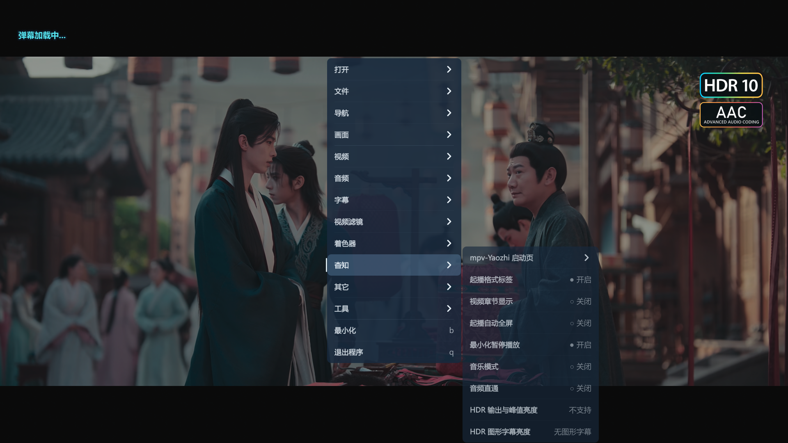

<div align="center">

<h1>mpv-Yaozhi</h1>

**面向 Windows 的高画质、沉浸声与中文交互一体化 mpv 播放方案**

[](https://github.com/Yaozhil/mpv-Yaozhi/releases/latest)
[](https://github.com/Yaozhil/mpv-Yaozhi/releases/latest)
[](https://github.com/mpv-player/mpv)
[](https://github.com/Yaozhil/mpv-Yaozhi/tree/codex/hdr-pgs-core-fix)
[](LICENSE.md)

[下载最新版本](https://github.com/Yaozhil/mpv-Yaozhi/releases/latest) ·  [查看特色功能](#核心能力) · [使用说明](#快速开始) · [问题反馈](https://github.com/Yaozhil/mpv-Yaozhi/issues)

</div>

mpv-Yaozhi 基于 [mpv](https://github.com/mpv-player/mpv) 与 [dyphire/mpv-config](https://github.com/dyphire/mpv-config) 持续维护。项目不仅整理配置与脚本，还提供针对 Windows 播放链路定制的 mpv 核心，重点改善 HDR/Dolby Vision、图形字幕、AV3A / Audio Vivid、多声道 PCM、音频源码直通、HTTPS 网盘播放与中文界面体验。

> 本项目是社区维护的第三方整合方案，并非 mpv 官方发行版。

## 新格式与核心增强

> [!TIP]
> **近期重点新增**
>
> VVC / H.266、AVS2 / AVS3、Animated WebP、HE-AAC 960 / DAB+，以及扩展到 27 种格式的专业起播标识。VVC 默认使用 Fraunhofer HHI `libvvdec`，同时保留 FFmpeg 原生 `vvc` 回退路径；Animated WebP 与 HE-AAC 960 / DAB+ 为 FFmpeg 9.0 能力的定向回移。

> [!IMPORTANT]
> **自编译核心能力**
>
> AV3A / Audio Vivid / AVS3 Audio、HDR Vivid 元数据识别、Dolby Vision P5 / P7 MEL/FEL / P8.1 / P8.4、HDR/DV 图形字幕，以及 5.1.4 / 7.1.4 PCM 高度声道。以上能力依赖本项目自编译 mpv / FFmpeg / SDL2 和定制补丁链，是本维护版区别于普通配置整合的核心部分。

## 界面预览


<details>
<summary>查看更多界面截图</summary>

### 底栏与媒体信息


### 杳知功能菜单



</details>

## 核心能力

| 领域 | 主要能力 |
| --- | --- |
| 播放核心 | 自维护 Windows x86-64 mpv 核心；D3D11、`gpu-next`、Schannel/libcurl 与定制补丁链 |
| HDR 与 Dolby Vision | HDR10、HDR10+、HLG、Dolby Vision P5 / P7 MEL/FEL / P8.1 / P8.4 播放；HDR Vivid 元数据识别 |
| 图形字幕 | 按片源自动区分 UHD HDR/DV 内封 PGS 与 SDR 图形字幕；支持手动色彩覆盖及 150–400 nits 独立亮度档位 |
| 沉浸声音频 | AV3A / Audio Vivid / AVS3 Audio 解码；5.1.4 / 7.1.4 PCM 高度声道布局；对象与 HOA 双耳渲染模式 |
| 音频源码直通 | AC-3、E-AC-3、Dolby TrueHD、DTS、DTS-HD HRA/MA；支持相应载荷中的 Dolby Atmos 与 DTS:X |
| 中文交互 | 深度定制 uosc、中文统计信息、弹幕、片头片尾、音乐模式、播放历史与专业起播格式标识 |
| 网络与媒体库 | AList/OpenList、HTTPS 媒体直链、Windows 系统证书链、签名 URL 历史记录与本地蓝光 ISO |

## 重点增强

### 专业起播格式标识

播放器会在首帧与画面边界稳定后识别当前画面标准和选中音轨，并在真实视频画面的右上安全区短暂显示。标识支持上下/左右黑边定位、多音轨切换刷新，以及“彩色徽章 / 透明白图标”两种样式。

- **画面标识**：Dolby Vision、HDR Vivid、HDR10+、HDR10、HLG、SDR
- **音频标识**：Audio Vivid、Dolby Atmos、DTS:X、TrueHD、DTS-HD、AC-4、MPEG-H、FLAC、PCM、AAC 等
- **菜单路径**：`杳知 > 起播格式标签`


### HDR 图形字幕增强

- 在 `gpu-next` 路径中独立管理 PGS、VobSub、DVB 等图形字幕色彩空间：UHD HDR/Dolby Vision 内封 PGS 默认随视频进入同一 HDR 映射链，外置或 SDR 图形字幕保守按 sRGB 处理。
- PGS 本身没有可靠的 HDR/SDR 色彩标记；菜单提供“自动判断 / 随视频（HDR 原生）/ SDR·sRGB”三种模式，可为非标准 DIY 字幕手动覆盖。
- 提供 150 / 203 / 250 / 300 / 400 nits 亮度档位，仅影响图形字幕，不改变视频画面、ASS/文本字幕与 OSD。
- Dolby Vision 继续由播放器内部完成解码、重塑与显示适配，不通过牺牲视频色彩正确性换取字幕修复。

### AV3A / Audio Vivid

- 自主集成 AV3A（Audio Vivid / AVS3 Audio）解码链路，支持常见 MP4、MPEG-TS 与独立音频数据。
- `native` 模式保留可用的传输声道与 PCM，不擅自将对象通道映射成扬声器位置。
- `binaural` 模式可将对象音频、床层加对象及 HOA 内容渲染为双声道耳机输出。
- AV3A / Audio Vivid 是播放器解码后输出 PCM，不属于 S/PDIF 源码直通格式。

### 5.1.4 / 7.1.4 高度声道输出

SDL PCM 输出链路保留具名扬声器布局，并为 Windows 写入匹配的 `WAVEFORMATEXTENSIBLE` speaker mask，避免退化为缺少扬声器语义的 `unknown10` / `unknown12`。

| 布局 | 声道顺序 |
| --- | --- |
| 5.1.4（10ch） | `FL-FR-FC-LFE-SL-SR-TFL-TFR-TBL-TBR` |
| 7.1.4（12ch） | `FL-FR-FC-LFE-BL-BR-SL-SR-TFL-TFR-TBL-TBR` |

10/12 声道设备打开已通过 Windows 自动回归，并完成真实多声道设备测试片复测。实际扬声器输出仍取决于声卡、驱动、HDMI/eARC 链路、回音壁或功放对相应布局的支持。

### 音频源码直通

- 支持 Dolby Digital（AC-3）、Dolby Digital Plus（E-AC-3）、Dolby TrueHD、DTS、DTS-HD HRA/MA。
- Dolby Atmos 可随 E-AC-3 / TrueHD 载荷传输，DTS:X 可随 DTS-HD 载荷传输。
- 提供“全部直通、仅 Dolby、仅 DTS、关闭直通”四种模式。
- 设备拒绝当前码流时可自动退出不兼容状态，恢复普通 PCM 输出，避免后续播放持续无声或卡住。
- **菜单路径**：`杳知 > 音频直通`

### 中文播放体验

- 统一使用 uosc 主菜单、右键菜单、播放列表与字幕内容选择。
- 底栏直接显示解码方式、画面规格、编码、音频、码率及网络状态。
- 支持中文弹幕搜索与加载、片头片尾查询/手动标记、章节显示和自动跳过。
- 音乐模式提供列表循环、单曲循环、随机防重复以及最小化继续播放。
- 最近播放支持本地文件、网络盘和签名 URL；临时离线不会导致历史记录被批量清除。

## 快速开始

### 系统要求

- Windows 10 / 11 64 位
- 支持 Direct3D 11 的显卡与较新的显卡驱动
- HDR、音频源码直通及 5.1.4/7.1.4 输出需要对应的显示器、声卡、HDMI/eARC 设备或功放支持

### 安装

1. 前往 [Releases](https://github.com/Yaozhil/mpv-Yaozhi/releases/latest) 下载最新整合包。
2. 将压缩包完整解压到可写目录，不要直接在压缩软件中运行。
3. 双击 `mpv.exe`，或把媒体文件拖入播放器。
4. 按需运行与 `mpv.exe` 同级的“杳知配置助手”，自动识别硬件并选择推荐配置。
5. 如需双击媒体文件直接播放，可运行根目录的 `注册视频文件关联.cmd`；关联写入当前用户，不依赖固定安装路径。

> 完整整合包已自带播放器核心和 `portable_config`。普通用户无需另外安装 mpv，也不需要手动复制脚本。

## 能力边界

为避免把“识别、解码、渲染与直通”混为一谈，以下边界请特别注意：

| 能力 | 当前状态 |
| --- | --- |
| Dolby Vision | 支持播放器内部处理并输出适合显示设备的 HDR10/PQ 或 SDR；不宣传原生 Dolby Vision 元数据透传 |
| HDR Vivid | 当前用于帧元数据识别与界面标识；尚未接入专用动态色调映射或显示端透传 |
| AV3A / Audio Vivid | 支持解码与 PCM 输出；对象/HOA 的扬声器级渲染不等同于普通 `channelmap`，当前显式空间渲染模式为双耳输出 |
| Dolby Atmos / DTS:X 源码直通 | 依赖原始音轨载荷、Windows 默认输出设备及回音壁/功放支持 |
| 5.1.4 / 7.1.4 PCM | 软件声道顺序与 Windows speaker mask 已验证；终端设备必须支持对应的 10/12 声道布局 |
| 远程 ISO | 当前 AList/OpenList 远程 ISO 不作为正式能力；建议下载到本地后播放 |

## 验证状态

当前发布核心为 `mpv v0.41.0-852-g8d504e9c0`，主要验证包括：

- Windows SDL 5.1.4（10ch）与 7.1.4（12ch）实际打开及具名布局校验
- 真实 7.1.4 测试片逐声道设备复测
- VVC / H.266、AVS2、AVS3 用户样片与多路径解码回归
- AV3A 常规多声道、对象音频、HOA、native 与 binaural 链路回归
- Animated WebP 实播回归；HE-AAC 960 / DAB+ 定向回移的二进制能力门禁
- HDR Vivid FATE 样本识别，以及 SDR + Audio Vivid 不误标 HDR Vivid
- HTTPS Range、重定向、Windows Schannel 系统证书链与完整便携配置回归

## 项目结构

```text
portable_config/        mpv 配置、脚本、菜单、字体与着色器
docs/                   功能说明、发布检查与界面图片
LICENSE.md              本项目自有代码与文档的 MIT 许可证
```

自定义核心的 mpv / SDL2 补丁、AV3A 构建集成与 Windows 自动回归位于 [`codex/hdr-pgs-core-fix`](https://github.com/Yaozhil/mpv-Yaozhi/tree/codex/hdr-pgs-core-fix) 维护分支；稳定整合包通过 [Releases](https://github.com/Yaozhil/mpv-Yaozhi/releases/latest) 发布。

## 反馈问题

提交 [Issue](https://github.com/Yaozhil/mpv-Yaozhi/issues) 时，建议提供：

- Windows 版本、显卡型号与驱动版本
- 播放器版本（运行 `mpv.com --version`）
- 音频设备、连接方式及 Windows 扬声器布局
- 可复现的文件格式、音视频编码和操作步骤
- `portable_config/files/mpv.log` 中与问题相关的片段

请勿公开包含网盘账号、签名 URL、访问令牌或私人文件路径的完整日志。

## 来源与许可

本项目参考或集成了以下项目及社区成果：

- [mpv-player/mpv](https://github.com/mpv-player/mpv)
- [dyphire/mpv-config](https://github.com/dyphire/mpv-config)
- [yosh-wang/mpv-stats.lua-zh-chinese-translation-](https://github.com/yosh-wang/mpv-stats.lua-zh-chinese-translation-)
- [yosh-wang/auto_bluray-ISO-](https://github.com/yosh-wang/auto_bluray-ISO-)
- uosc、FFmpeg、libplacebo、SDL2 及其他随项目保留来源说明的开源组件

本仓库自有代码与文档采用 [MIT License](LICENSE.md)。第三方脚本、着色器、字体、二进制组件与资源继续遵循各自的许可证和版权声明。
